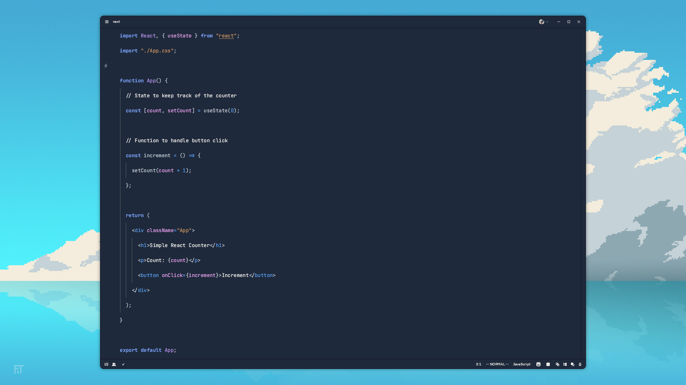

  <h1>Mygo!!!!! Theme</h1>

### Preview

  

## Installation

1. Clone this repository into your computer.
2. Copy the `Mygo.json` file from `themes` folder to `~/.config/zed/themes`.
3. Enjoy

### Setelah meng-install Mygo!!!!! Theme
##### Anon Tokyo & Hinapyo

